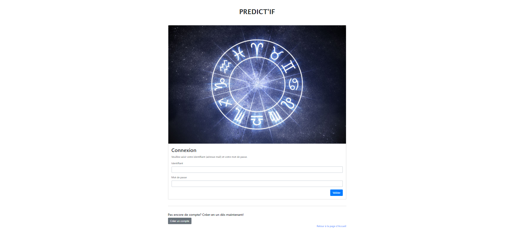
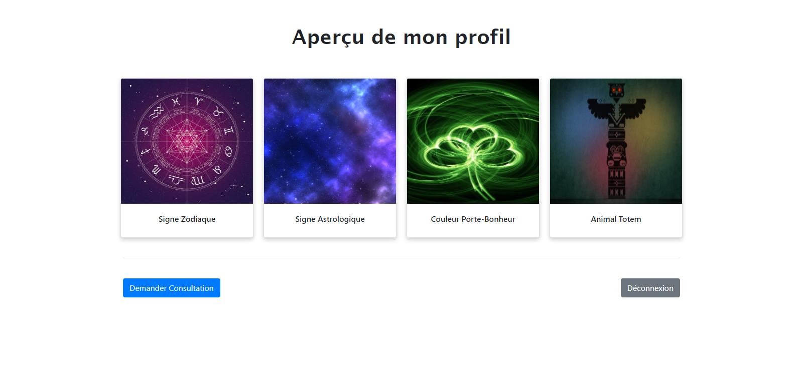
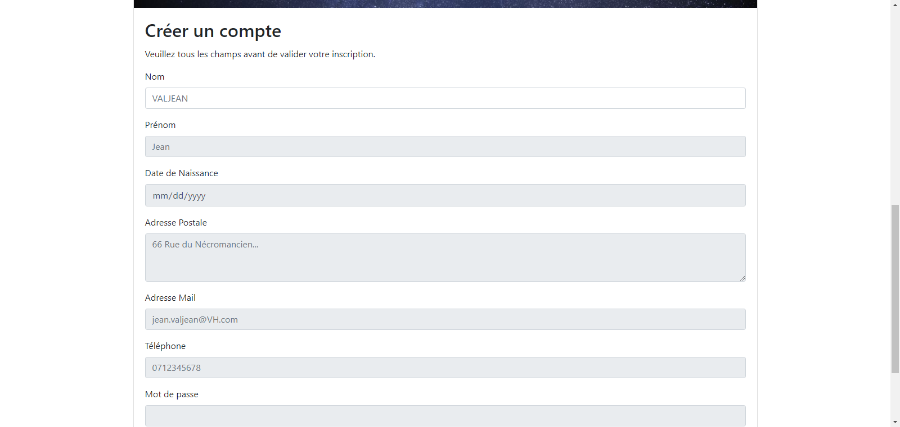
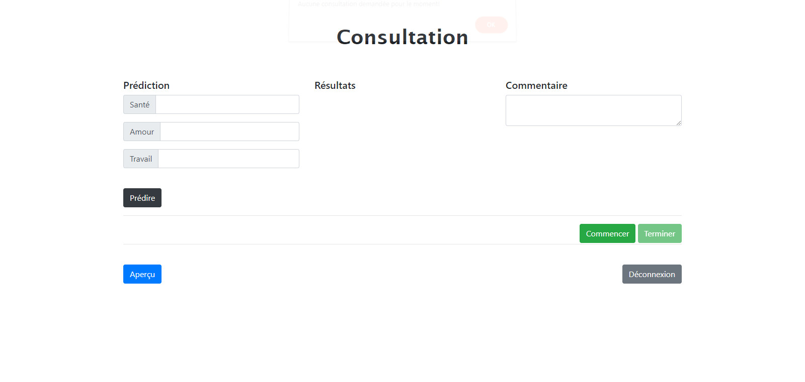

# DASI PREDICT'IF

<!-- vscode-markdown-toc -->
* 1. [Forewords](#Forewords)
* 2. [Version](#Version)
* 3. [Specifications](#Specifications)
* 4. [Compile and run](#Compileandrun)
	* 4.1. [Config](#Config)
	* 4.2. [Steps](#Steps)
* 5. [Preview](#Preview)
	* 5.1. [Log in page](#Loginpage)
	* 5.2. [User Dashboard](#UserDashboard)
	* 5.3. [Sign up page](#Signuppage)
	* 5.4. [Appointement page](#Appointementpage)
* 6. [Authors](#Authors)

<!-- vscode-markdown-toc-config
	numbering=true
	autoSave=true
	/vscode-markdown-toc-config -->
<!-- /vscode-markdown-toc -->

##  1. Forewords
PREDICT'IF is a JAVA web application for life predictions. User can sign up, log in and book an appointment with a well recognized medium, fortune-teller, astrologer and more! The company's staff can then log into the website appearing as a fortune-teller (or medium...) and give predictions using various tools! 

##  2. Version
Stable release - version 1.0 - May 25, 2020

##  3. Specifications
please refer to L1_B3204_TOUT_BREMARD.pdf

##  4. Compile and run

###  4.1. Config
- Apache Netbeans IDE 11.3
- java SDK jdk1.8.0
###  4.2. Steps
1) Create and name database according to persistence.xml
2) Create and name server using Apache Tomcat
3) Clean and build
4) Run on your favorite browser!

##  5. Preview
###  5.1. Log in page

###  5.2. User Dashboard

###  5.3. Sign up page

###  5.4. Appointement page

##  6. Authors
- TOUT Iyad
- BREMARD Alexandre